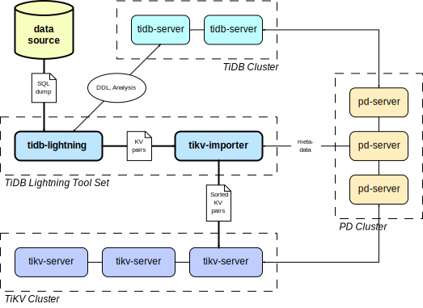

# TiDB Lightning

**TiDB Lightning** is a tool for fast full import of large amounts of data into a TiDB cluster.
Currently, we support reading SQL dump exported via mydumper.

* [Detailed documentation](docs/en_US/README.md)
* [简体中文文档](docs/zh_CN/README.md)
