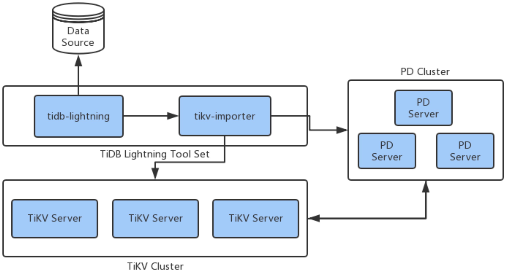

# TiDB Lightning

TiDB Lightning is a data import tool which is used to fast import a large amount of data to the TiDB cluster. Currently, it only supports source data in the Mydumper file format and in the future it will support more formats like CSV.

Now TiDB Lightning only supports full import of new tables. During the importing process, the cluster stops the service; as a result, TiDB Lightning is not suitable for importing data online.

## TiDB Lightning architecture

The following diagram shows the architecture of TiDB Lightning: 

TiDB Lightning has two components:

- `tidb-lightning`
    
    The front-end part of TiDB Lightning. It transforms the source data into Key-Value (KV) pairs and writes the data into `tikv-importer`.
- `tikv-importer`
    
    The back-end part of TiDB Lightning. It caches, sorts, and splits the KV pairs written by `tidb-lightning` and imports the KV pairs to the TiKV cluster.

## TiDB Lightning workflow

1. Before importing data, `tidb-lightning` automatically switches the TiKV mode to the import mode via API.
2. `tidb-lightning` obtains data from the data source, transforms the source data into KV data, and then writes the data into `tikv-importer`.
3. When the data written by `tidb-lightning` reaches a specific size, `tidb-lightning` sends the `Import` command to `tikv-importer`.
4. `tikv-importer` splits and schedules the TiKV data of the target cluster and then imports the data to the TiKV cluster.
5. `tidb-lightning` transforms and imports the source data continuously until it finishes importing the data in the source data directory.
6. `tidb-lightning` performs the `Compact`, `Checksum`, and `Analyze` operation on tables in the target cluster.
7. `tidb-lightning` automatically switches the TiKV mode to the normal mode. Then the TiDB cluster can provide services normally.

## Deploy process

### Hardware requirements

See [Hardware requirements of TiDB Lightning](docs/tidb-lightning-user-guide.md#hardware-requirements)

### Prepare

Before importing, you should:

- Deploy a set of TiDB cluster (TiDB version is 2.0.4 or later) which is the target cluster for importing (the target cluster).
- Prepare the binary file and the configuration file of `tikv-importer`. It is recommended to use standalone deployment.
- Prepare the binary file and the configuration file of `tidb-lightning`. It is recommended to use standalone deployment.

Download the installation packages of `tikv-importer` and `tidb-lightning` via:

https://download.pingcap.org/tidb-lightning-latest-linux-amd64.tar.gz

### Deploy

See [TiDB Lightning User Guide](docs/tidb-lightning-user-guide.md#deploy)
