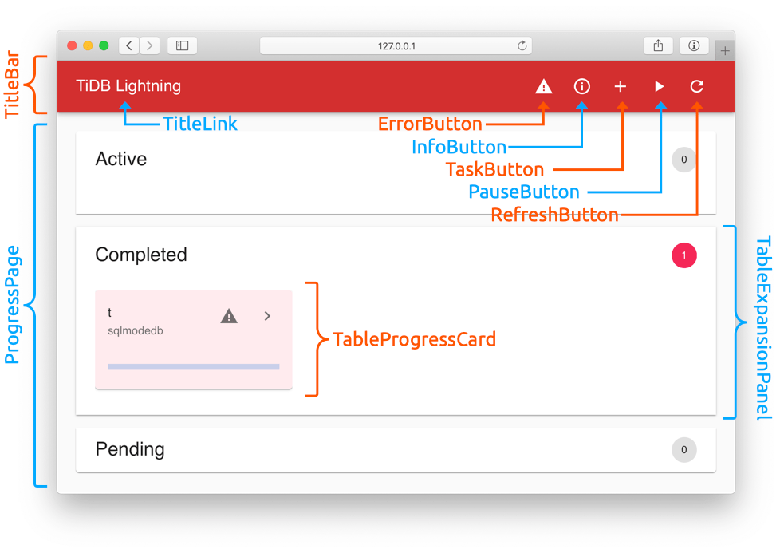

TiDB Lightning Web Interface
============================

TiDB Lightning provides a web interface for local monitoring task control. The
app is written using [Material-UI] based on [React].

[Material-UI]: https://material-ui.com/
[React]: https://reactjs.org/

Building
--------

The web app requires `npm` to build. It can be compiled by running webpack in
*this* directory

```sh
# from `web/src/*` produces `web/dist/*`
cd web/
npm install
npm run build
```

or, equivalently, running the make command in the *parent* directory.

```sh
# from `web/src/*` produces `web/dist/*`
make web
```

The output can be found in the `web/dist/` folder. Lightning embeds the entire
`web/dist/` folder into Go code via [vfsgen]. The web app compilation and Go
code conversion can be done via the make command

```sh
# from `web/dist/*` produces `lightning/web/res_vfsdata.go`
make data_parsers
```

For web development, you could build a special version of `tidb-lightning` which
reads directly from `web/dist/` by

```sh
make lightning_for_web
```

[vfsgen]: https://github.com/shurcooL/vfsgen

Front-end
---------

The TiDB Lightning web interface is a single-page application (SPA). The file
`public/index.html` is the HTML template before rendering. The actual source
code are written in TypeScript in the `src/*` folder.

The application is divided into 3 "pages":

<details><summary><strong>ProgressPage</strong> (reachable by clicking the "TiDB Lightning" link on the TitleBar)</summary>



</details>
<details><summary><strong>TableProgressPage</strong> (reachable by clicking the ">" button on a TableProgressCard)</summary>


</details>
<details><summary><strong>InfoPage</strong> (reachable by clicking the "ⓘ" InfoButton on the TitleBar)</summary>


</details>

The components inside the TitleBar and each page are highlighted in the above
images. The associated dialogs and menus are embedded into each component
directly.

Back-end
--------

The "back-end" is Lightning itself. The API defined by Lightning is declared in
`src/api.ts`. The corresponding server code is in `lightning/lightning.go`.
Unless otherwise specified, all APIs return JSON and is in the form
`{"error": "message"}` in case of error.
